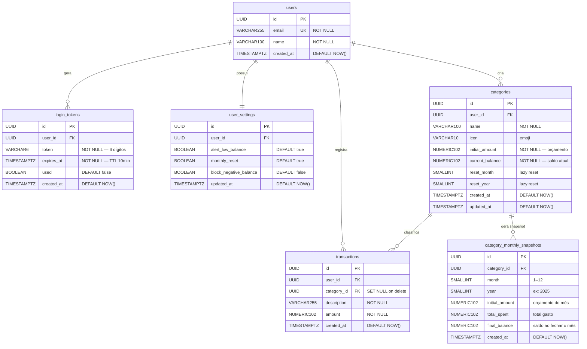

# 🗃️ Tá Liso App — Diagrama de Entidades (ERD)

---

## Relacionamentos

| De | Para | Cardinalidade | Comportamento |
|---|---|---|---|
| `users` | `login_tokens` | 1 : N | ON DELETE CASCADE |
| `users` | `user_settings` | 1 : 1 | ON DELETE CASCADE |
| `users` | `categories` | 1 : N | ON DELETE CASCADE |
| `users` | `transactions` | 1 : N | ON DELETE CASCADE |
| `categories` | `transactions` | 1 : N | ON DELETE SET NULL |
| `categories` | `category_monthly_snapshots` | 1 : N | ON DELETE CASCADE |

---

## Descrição das Entidades

### `users` — Entidade central
Armazena o cadastro do usuário. O `email` é o identificador único usado no login passwordless. O `name` é editável pela tela de Configurações.

### `login_tokens` — Autenticação
Cada solicitação de login gera um token numérico de 6 dígitos. O campo `used` é marcado como `true` após o primeiro uso válido, impedindo reutilização. O `expires_at` controla o TTL de 10 minutos.

### `user_settings` — Configurações
Criado automaticamente junto com o usuário. Armazena os 3 toggles da tela de Configurações: alerta de saldo crítico, reset mensal automático e bloqueio de saldo negativo.

### `categories` — Core
Cada categoria tem um orçamento (`initial_amount`) e um saldo atual (`current_balance`). Os campos `reset_month` e `reset_year` implementam o mecanismo de **lazy reset**: ao invés de um cron job, o sistema compara esses campos com o mês atual no momento do acesso e reseta o saldo se necessário.

### `transactions` — Core
Registra cada lançamento feito via chat. O `category_id` usa `SET NULL` na exclusão da categoria para preservar o histórico financeiro do usuário mesmo que a categoria seja removida.

### `category_monthly_snapshots` — Histórico
Gerado automaticamente no momento do lazy reset. Armazena o orçamento, total gasto e saldo final de cada categoria em cada mês encerrado. Alimenta a tela de Resumo para navegação por meses anteriores.
