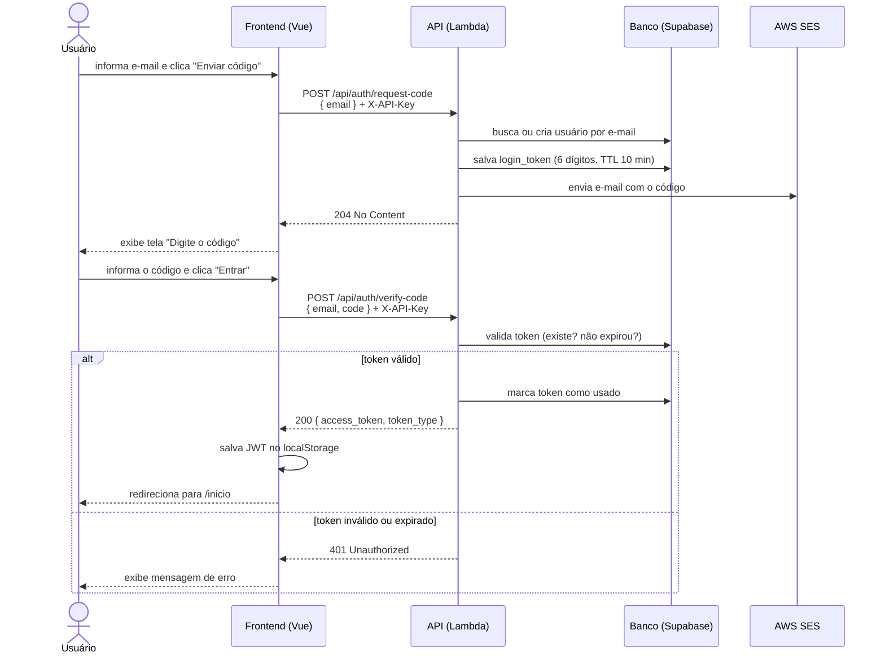
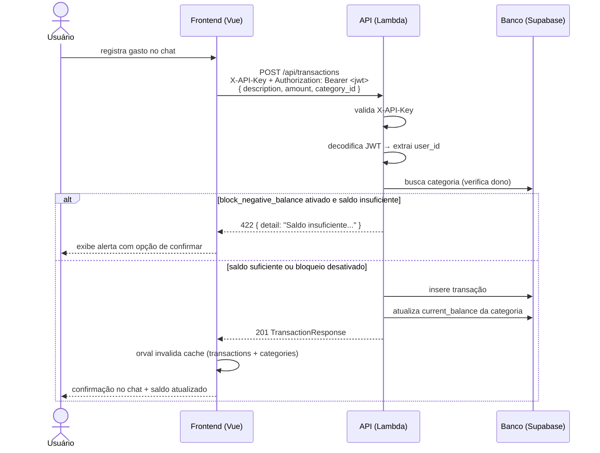
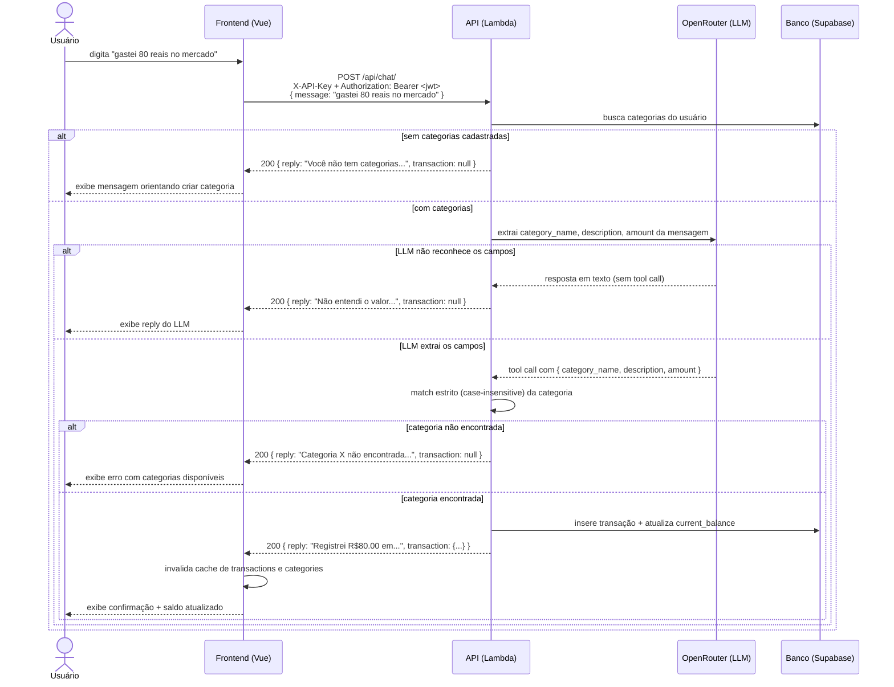
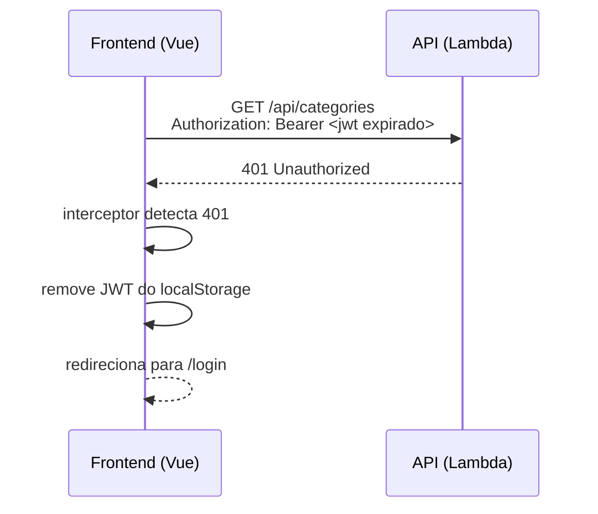

# Tá Liso API — Guia de Integração para o Frontend (Vue.js)

## Visão Geral

| Item | Valor |
|---|---|
| Base URL (produção) | `https://ta-liso-app.online` |
| Base URL (local) | `http://localhost:8000` |
| Documentação interativa | `https://ta-liso-app.online/api/docs` |
| OpenAPI JSON | `https://ta-liso-app.online/api/openapi.json` |

---

## Autenticação em Duas Camadas

Todas as rotas `/api/*` exigem **dois** headers simultâneos:

| Header | Quando |
|---|---|
| `X-API-Key: <chave>` | Sempre — em toda requisição |
| `Authorization: Bearer <jwt>` | Em todas as rotas exceto `/api/auth/*` |

A rota `/health` não exige nenhum header.

---

## Diagramas de Sequência

### Fluxo de Login



### Fluxo de Requisição Autenticada (ex: criar transação)



### Fluxo de Registro via Chat (linguagem natural)



### Fluxo de Token Expirado



---

## Setup

### Instalação

```bash
npm install @tanstack/vue-query axios
npm install -D orval
```

### Variáveis de Ambiente (.env)

```env
VITE_API_URL=https://ta-liso-app.online
VITE_API_KEY=sua-api-key-aqui
```

### Cliente axios base

O orval usa este arquivo como `mutator` — ele injeta automaticamente o `X-API-Key` e o JWT em todas as requisições geradas.

O interceptor de resposta também é responsável por tratar o **JWT expirado**: qualquer `401` disparado pelo backend (token vencido, inválido ou ausente) limpa o localStorage e redireciona para `/login`. O JWT tem validade de **7 dias** — após esse prazo o usuário precisa fazer login novamente.

```ts
// src/services/api.ts
import axios from 'axios'

export const api = axios.create({
  baseURL: import.meta.env.VITE_API_URL,
  headers: {
    'X-API-Key': import.meta.env.VITE_API_KEY,
  },
})

api.interceptors.request.use((config) => {
  const token = localStorage.getItem('access_token')
  if (token) {
    config.headers.Authorization = `Bearer ${token}`
  }
  return config
})

api.interceptors.response.use(
  (response) => response,
  (error) => {
    // Cobre dois cenários:
    // 1. JWT expirado (após 7 dias de sessão ativa)
    // 2. Usuário sem autenticação tentando acessar rota protegida
    if (error.response?.status === 401) {
      localStorage.removeItem('access_token')
      window.location.href = '/login'
    }
    return Promise.reject(error)
  },
)
```

### Configurar o orval

Crie `orval.config.ts` na raiz do projeto frontend:

```ts
// orval.config.ts
import { defineConfig } from 'orval'

export default defineConfig({
  taliso: {
    input: 'https://ta-liso-app.online/api/openapi.json',
    output: {
      mode: 'tags-split',         // um arquivo por tag: auth, categories, transactions, settings
      target: 'src/api/generated',
      client: 'vue-query',        // gera hooks TanStack Query para Vue
      httpClient: 'axios',
      override: {
        mutator: {
          path: 'src/services/api.ts',  // usa o axios configurado acima
          name: 'api',
        },
        // Invalida o cache de categories sempre que transactions mudar
        // (criar/editar/deletar transação altera current_balance)
        operations: {
          create_transaction_api_transactions__post: {
            mutator: { path: 'src/services/api.ts', name: 'api' },
            query: { useQuery: false },
          },
        },
      },
    },
  },
})
```

Adicione o script no `package.json`:

```json
"scripts": {
  "gen:api": "orval"
}
```

### Gerar os hooks

```bash
npm run gen:api
```

Isso cria em `src/api/generated/`:

```
src/api/generated/
├── auth.ts          # usePostApiAuthRequestCode, usePostApiAuthVerifyCode
├── categories.ts    # useGetApiCategories, usePostApiCategories,
│                    # usePutApiCategoriesCategoryId, useDeleteApiCategoriesCategoryId
├── transactions.ts  # useGetApiTransactions, usePostApiTransactions,
│                    # usePutApiTransactionsTransactionId, useDeleteApiTransactionsTransactionId
├── chat.ts          # usePostApiChat
└── settings.ts      # useGetApiSettings, usePatchApiSettings
```

> Rode `npm run gen:api` sempre que o backend adicionar ou alterar endpoints.

### Configurar TanStack Query no main.ts

```ts
// src/main.ts
import { createApp } from 'vue'
import { VueQueryPlugin, QueryClient } from '@tanstack/vue-query'
import App from './App.vue'

const queryClient = new QueryClient({
  defaultOptions: {
    queries: {
      staleTime: 1000 * 60 * 5, // 5 minutos
      retry: 1,
    },
  },
})

createApp(App)
  .use(VueQueryPlugin, { queryClient })
  .mount('#app')
```

---

## Usando os Hooks Gerados

### Autenticação

Os hooks de auth são `useMutation` — não fazem cache, só disparam requisições.

```vue
<!-- src/views/LoginView.vue -->
<script setup lang="ts">
import { ref } from 'vue'
import { useRouter } from 'vue-router'
import {
  usePostApiAuthRequestCode,
  usePostApiAuthVerifyCode,
} from '@/api/generated/auth'

const router = useRouter()
const email = ref('')
const code = ref('')
const step = ref<'email' | 'code'>('email')

const requestCode = usePostApiAuthRequestCode()
const verifyCode = usePostApiAuthVerifyCode({
  mutation: {
    onSuccess: ({ data }) => {
      localStorage.setItem('access_token', data.access_token)
      router.push('/inicio')
    },
  },
})

async function onRequestCode() {
  await requestCode.mutateAsync({ data: { email: email.value } })
  step.value = 'code'
}
</script>
```

### Categorias

```vue
<!-- src/views/CategoriesView.vue -->
<script setup lang="ts">
import {
  useGetApiCategories,
  usePostApiCategories,
  useDeleteApiCategoriesCategoryId,
} from '@/api/generated/categories'
import { useQueryClient } from '@tanstack/vue-query'
import { getGetApiCategoriesQueryKey } from '@/api/generated/categories'

const queryClient = useQueryClient()

const { data: categories, isLoading } = useGetApiCategories()

const createCategory = usePostApiCategories({
  mutation: {
    onSuccess: () => queryClient.invalidateQueries({
      queryKey: getGetApiCategoriesQueryKey(),
    }),
  },
})

const deleteCategory = useDeleteApiCategoriesCategoryId({
  mutation: {
    onSuccess: () => queryClient.invalidateQueries({
      queryKey: getGetApiCategoriesQueryKey(),
    }),
  },
})
</script>

<template>
  <div v-if="isLoading">Carregando...</div>
  <ul v-else>
    <li v-for="cat in categories?.data" :key="cat.id">
      {{ cat.icon }} {{ cat.name }} — R$ {{ cat.current_balance }}
      <button @click="deleteCategory.mutate({ categoryId: cat.id })">Excluir</button>
    </li>
  </ul>
</template>
```

### Transações

> Criar, editar ou deletar uma transação altera o `current_balance` das categorias.
> Invalide **ambos** os caches no `onSuccess`.

```vue
<!-- src/views/ChatView.vue -->
<script setup lang="ts">
import {
  usePostApiTransactions,
  getGetApiTransactionsQueryKey,
} from '@/api/generated/transactions'
import { getGetApiCategoriesQueryKey } from '@/api/generated/categories'
import { useQueryClient } from '@tanstack/vue-query'
import { useApiError } from '@/composables/useApiError'

const queryClient = useQueryClient()
const { getErrorMessage } = useApiError()

const createTransaction = usePostApiTransactions({
  mutation: {
    onSuccess: () => {
      queryClient.invalidateQueries({ queryKey: getGetApiTransactionsQueryKey() })
      queryClient.invalidateQueries({ queryKey: getGetApiCategoriesQueryKey() })
    },
    onError: (error) => {
      // 422 → "Saldo insuficiente: disponível R$ 30,00, solicitado R$ 200,00"
      alert(getErrorMessage(error))
    },
  },
})

function registrarGasto(description: string, amount: number, categoryId?: string) {
  createTransaction.mutate({
    data: { description, amount, category_id: categoryId },
  })
}
</script>
```

### Chat (registro via linguagem natural)

O endpoint `POST /api/chat/` recebe uma mensagem em português e retorna um `reply` (texto para exibir ao usuário) e, quando uma transação é criada com sucesso, o objeto `transaction`.

**Schema da requisição:**
```ts
{ message: string }
```

**Schema da resposta:**
```ts
{
  reply: string                // sempre presente — exibir ao usuário
  transaction: {               // null quando nenhuma transação foi criada
    id: string
    category_id: string
    description: string
    amount: string             // Decimal serializado como string
    created_at: string
  } | null
}
```

**Casos possíveis (todos retornam HTTP 200):**

| Situação | `transaction` | `reply` |
|---|---|---|
| Transação registrada | objeto | "Registrei R$X em Categoria (descrição)." |
| LLM não identificou os campos | `null` | Pergunta do LLM (ex: "Quanto você gastou?") |
| Categoria mencionada não existe | `null` | "Categoria X não encontrada. Disponíveis: ..." |
| Usuário sem categorias cadastradas | `null` | "Você não tem categorias cadastradas ainda..." |

> O match de categoria é **estrito** (case-insensitive exact match) feito pelo servidor — o frontend não precisa tratar erros de categoria. Basta exibir o `reply` sempre.

```vue
<!-- src/views/ChatView.vue -->
<script setup lang="ts">
import { ref } from 'vue'
import { usePostApiChat } from '@/api/generated/chat'
import { getGetApiTransactionsQueryKey } from '@/api/generated/transactions'
import { getGetApiCategoriesQueryKey } from '@/api/generated/categories'
import { useQueryClient } from '@tanstack/vue-query'

const queryClient = useQueryClient()
const messages = ref<{ from: 'user' | 'bot'; text: string }[]>([])
const input = ref('')

const chat = usePostApiChat({
  mutation: {
    onSuccess: ({ data }) => {
      messages.value.push({ from: 'bot', text: data.reply })
      if (data.transaction) {
        // Transação criada — atualiza saldos
        queryClient.invalidateQueries({ queryKey: getGetApiTransactionsQueryKey() })
        queryClient.invalidateQueries({ queryKey: getGetApiCategoriesQueryKey() })
      }
    },
    onError: () => {
      messages.value.push({ from: 'bot', text: 'Erro ao processar mensagem. Tente novamente.' })
    },
  },
})

function send() {
  const text = input.value.trim()
  if (!text) return
  messages.value.push({ from: 'user', text })
  input.value = ''
  chat.mutate({ data: { message: text } })
}
</script>

<template>
  <div class="chat">
    <div v-for="(msg, i) in messages" :key="i" :class="msg.from">
      {{ msg.text }}
    </div>
    <input v-model="input" @keyup.enter="send" placeholder="Ex: gastei 50 reais no mercado" />
    <button @click="send" :disabled="chat.isPending.value">Enviar</button>
  </div>
</template>
```

### Configurações do Usuário

```vue
<!-- src/views/SettingsView.vue -->
<script setup lang="ts">
import {
  useGetApiSettings,
  usePatchApiSettings,
  getGetApiSettingsQueryKey,
} from '@/api/generated/settings'
import { useQueryClient } from '@tanstack/vue-query'

const queryClient = useQueryClient()

const { data: settings } = useGetApiSettings()

const updateSettings = usePatchApiSettings({
  mutation: {
    onSuccess: (response) => {
      // Atualiza o cache diretamente sem refetch
      queryClient.setQueryData(getGetApiSettingsQueryKey(), response)
    },
  },
})
</script>
```

### Logout

```ts
// src/composables/useAuth.ts
import { useQueryClient } from '@tanstack/vue-query'
import { useRouter } from 'vue-router'

export function useAuth() {
  const queryClient = useQueryClient()
  const router = useRouter()

  function logout() {
    localStorage.removeItem('access_token')
    queryClient.clear() // limpa todos os caches
    router.push('/login')
  }

  return { logout }
}
```

---

## Tratamento de Erros

```ts
// src/composables/useApiError.ts
import type { AxiosError } from 'axios'

export function useApiError() {
  function getErrorMessage(error: unknown): string {
    const axiosError = error as AxiosError<{ detail: string }>
    return axiosError.response?.data?.detail ?? 'Erro inesperado. Tente novamente.'
  }
  return { getErrorMessage }
}
```

### Códigos de Erro

| Status | Significado |
|---|---|
| `401 Unauthorized` | API Key inválida **ou** JWT ausente/expirado |
| `400 Bad Request` | Dados inválidos (ex: categoria com nome duplicado) |
| `404 Not Found` | Recurso não encontrado |
| `422 Unprocessable Entity` | Regra de negócio violada (ex: `block_negative_balance` ativado e saldo insuficiente) |

---

## Cenários BDD Relevantes para o Frontend

### Feature: Login sem senha via e-mail

```gherkin
Scenario: Usuário solicita código com e-mail válido
  Given que o usuário está na tela de login
  When ele informa um e-mail válido e clica em "Enviar código"
  Then o frontend deve chamar POST /api/auth/request-code
  And redirecionar para a tela de validação do código

Scenario: Usuário autentica com código válido
  Given que o usuário está na tela de validação
  When ele informa o código de 6 dígitos corretamente
  Then o frontend deve chamar POST /api/auth/verify-code
  And salvar o access_token no localStorage
  And redirecionar para /inicio

Scenario: Usuário informa código incorreto ou expirado
  Given que o usuário está na tela de validação
  When ele informa um código errado ou expirado
  Then a API retorna 401
  And o frontend deve exibir mensagem de erro
  And permitir solicitar um novo código

Scenario: Usuário tenta acessar tela protegida sem autenticação
  Given que não há access_token no localStorage
  When o usuário tenta acessar qualquer rota protegida
  Then o Vue Router deve redirecionar para /login

Scenario: JWT do usuário expira durante uma sessão ativa
  Given que o usuário está autenticado com um JWT válido
  And o JWT tem validade de 7 dias
  When o JWT expira e o usuário realiza qualquer requisição autenticada
  Then a API retorna 401 Unauthorized
  And o interceptor do axios deve remover o access_token do localStorage
  And redirecionar o usuário para /login
  And o usuário deve realizar o fluxo de login novamente (solicitar novo código por e-mail)
```

### Feature: Gerenciamento de Categorias

```gherkin
Scenario: Criar categoria com nome duplicado
  Given que já existe uma categoria "Alimentação"
  When o usuário tenta criar outra com o mesmo nome
  Then a API retorna 400
  And o frontend deve exibir "Nome de categoria já existe"

Scenario: Exibir progresso de cada categoria
  Given que o usuário acessa a tela Categorias
  Then o frontend deve calcular o percentual:
    percentual = (initial_amount - current_balance) / initial_amount * 100
  And colorir a barra: verde < 70%, amarelo 70–89%, vermelho ≥ 90%
```

### Feature: Gerenciamento de Transações

```gherkin
Scenario: Criar transação reduz o saldo da categoria
  Given que o usuário registra uma transação
  When a API retorna 201
  Then o frontend deve invalidar os caches de transactions E categories
  And exibir o saldo atualizado da categoria

Scenario: Bloquear transação com saldo insuficiente (bloqueio ativado)
  Given que block_negative_balance está ativado
  When o usuário tenta registrar uma transação acima do saldo
  Then a API retorna 422
  And o frontend deve exibir o erro sem tentar confirmar novamente

Scenario: Saldo insuficiente com bloqueio desativado
  Given que block_negative_balance está desativado
  When a API retorna 422 com detalhe de saldo insuficiente
  Then o frontend deve exibir alerta com botões "Cancelar" e "Confirmar"
  And ao confirmar, registrar a transação normalmente (saldo ficará negativo)
```

### Feature: Registro de gastos via chat (linguagem natural)

```gherkin
Scenario: Registrar gasto via mensagem de texto
  Given que o usuário possui a categoria "Alimentação"
  When ele envia "gastei 80 reais no mercado" via POST /api/chat/
  Then a API retorna 200 com transaction preenchido
  And o frontend deve invalidar os caches de transactions e categories
  And exibir o campo reply como mensagem do bot

Scenario: Mensagem sem valor ou categoria não reconhecidos pelo LLM
  When o LLM não identifica os campos necessários
  Then a API retorna 200 com transaction null
  And reply contém uma pergunta do LLM
  And o frontend exibe o reply sem alterar os caches

Scenario: Categoria mencionada não existe (match estrito pelo servidor)
  Given que o usuário possui apenas a categoria "Débito"
  When ele envia uma mensagem mencionando "Crédito"
  Then a API retorna 200 com transaction null
  And reply informa que a categoria não foi encontrada
  And lista as categorias disponíveis

Scenario: Usuário envia mensagem sem ter categorias cadastradas
  Given que o usuário não tem nenhuma categoria cadastrada
  When ele envia qualquer mensagem via chat
  Then a API retorna 200 com transaction null
  And reply orienta o usuário a criar uma categoria primeiro
```

### Feature: Configurações do usuário

```gherkin
Scenario: Fazer logout
  Given que o usuário clica em "Sair da conta"
  Then o frontend deve remover o access_token do localStorage
  And limpar todos os caches do TanStack Query (queryClient.clear())
  And redirecionar para /login

Scenario: Ativar/desativar bloqueio de saldo negativo
  When o usuário alterna o toggle de block_negative_balance
  Then o frontend deve chamar PATCH /api/settings
  And atualizar o cache local imediatamente (sem refetch)
```

---

## Checklist de Integração

- [ ] `.env` criado com `VITE_API_URL` e `VITE_API_KEY`
- [ ] `src/services/api.ts` configurado com interceptors de JWT e 401
- [ ] `orval.config.ts` criado na raiz do projeto
- [ ] `npm run gen:api` executado com sucesso — arquivos gerados em `src/api/generated/`
- [ ] `VueQueryPlugin` registrado no `main.ts`
- [ ] Hooks de mutação de transações invalidam cache de `categories` também
- [ ] Hook de chat (`usePostApiChat`) invalida caches de `transactions` e `categories` quando `transaction !== null`
- [ ] Chat exibe `reply` sempre, independente de `transaction` ser null ou não
- [ ] Vue Router com guard de autenticação (`beforeEach` checa localStorage)
- [ ] `queryClient.clear()` no logout
- [ ] Rodar `npm run gen:api` novamente sempre que o backend mudar
- [ ] Testar fluxo completo com `https://ta-liso-app.online/api/docs`
